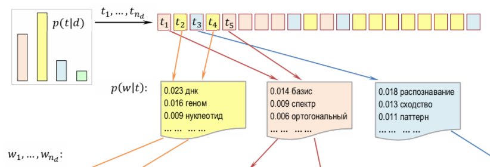

# Transactions portrait

This service creates a portrait of a person based on ones banking transactions. Having uploaded a file listing transaction you get an overview analysis including:
- most popular areas
- sex probability
- age probability

## Analysis mechamizm 

To build the portrait of a user we used topic modeling. We presume that user's transactions follow a generative model: first a user chooses a topic from the distribution p(t|u) and then a transaction from p(w|t). Here U is the set of users, T stands for the set of topics and W is the set of transactions.

## Generative topic model scheme: ##

