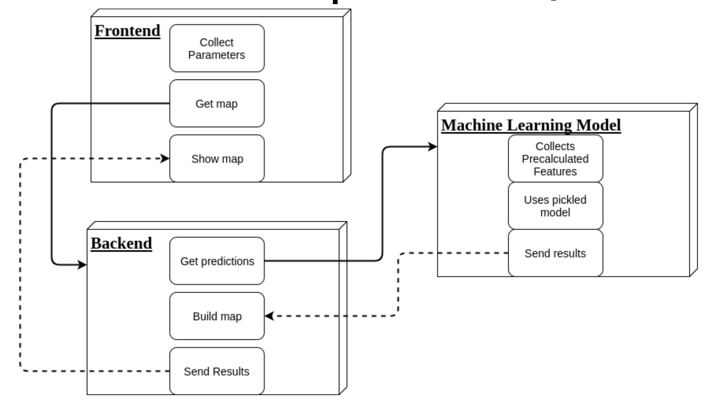

# Aircraft traffic monitoring system

This service represent a simple site. It was developed for monitoring and predicting the future passengers traffic.
Received information is designed to help in the solving the logistic problems of air company.

This repo contains the code of ML backend, server and front-end implementation.
Server was implemented using Django module.

This system is available on the 34.228.36.23

The interface of our project user-friendly and easy to use.

## Technical scheme of realization: ##

